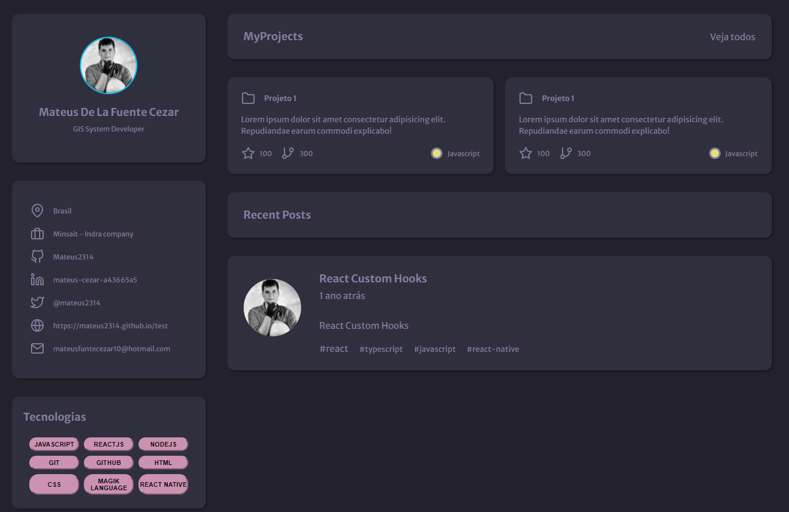

   

<h3 align="center">
  Nesse desáfio do Discover, foi pedido para construir uma página de portifolio.
</h3>

  

<h1 align="center">
  
</h1>

## Tecnologias :computer::

<ul>
  <li>
    <a href="https://developer.mozilla.org/pt-BR/docs/Web/HTML/">HTML</a>
  </li>

  <li>
     <a href="https://developer.mozilla.org/pt-BR/docs/Web/CSS/">CSS</a>
  </li>
</ul>

---

